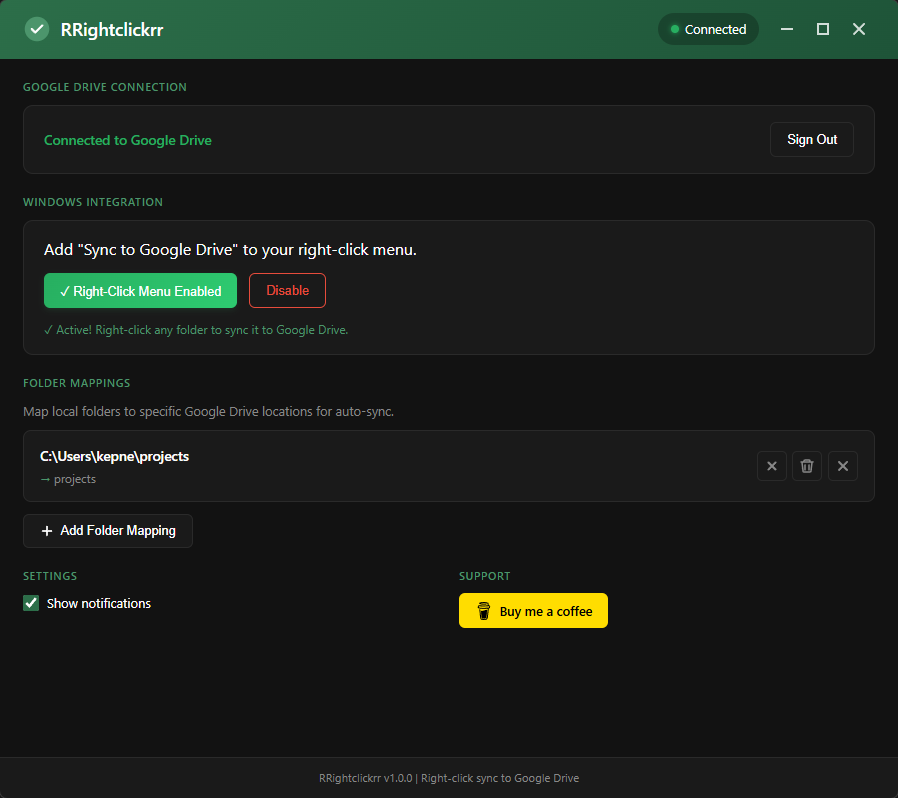

# RRightclickrr

**Right-click any folder to sync it to Google Drive.**


<p align="center">
  
</p>

## ✨ Features

- 📁 **Sync to Google Drive** - Right-click any folder → syncs entire folder structure
- 📋 **Copy to Drive** - One-time upload without watching for changes
- 🔗 **Get Drive URL** - Right-click synced folder → instantly copies Drive URL
- 🌐 **Open in Drive** - Open synced items directly in your browser
- 🚫 **Subfolder Exclusions** - Exclude specific subfolders from syncing
- 🗑️ **Delete from Drive** - Remove synced folders from Google Drive
- 👀 **Auto-Watch** - Monitors synced folders and uploads changes automatically
- 📊 **Progress Window** - Real-time upload progress with speed stats
- 🔔 **Notifications** - System notifications when files sync

## 📥 Download

**[Download Latest Release](https://github.com/Kepners/rrightclickrr/releases/latest)**

| File | Description |
|------|-------------|
| `RRightclickrr Setup X.X.X.exe` | Windows Installer (recommended) |
| `RRightclickrr-Portable-X.X.X.exe` | Portable version (no install) |

## 🚀 Quick Start

1. **Install** - Run the installer
2. **Sign In** - Click "Sign in with Google" in the app
3. **Enable Menu** - Click "Enable Right-Click Menu"
4. **Sync!** - Right-click any folder → "Show more options" → "Sync to Google Drive"

## 🎯 Usage

### Sync a Folder (with auto-watch)
Right-click folder → **"Sync to Google Drive"**
- Uploads entire folder structure
- Watches for future changes
- Auto-syncs when files change

### Copy to Drive (one-time)
Right-click folder → **"Copy to Google Drive"**
- Uploads folder once
- No watching/auto-sync

### Get Share Link
Right-click synced folder → **"Copy Google Drive Link"**
- Copies shareable link to clipboard

### Open in Drive
Right-click synced item → **"Open in Google Drive"**
- Opens item directly in browser

## ⚙️ Build from Source

```bash
# Clone
git clone https://github.com/Kepners/rrightclickrr.git
cd rrightclickrr

# Install dependencies
npm install

# Create .env file with your Google OAuth credentials
# GOOGLE_CLIENT_ID=your-client-id.apps.googleusercontent.com
# GOOGLE_CLIENT_SECRET=your-client-secret

# Run in development
npm start

# Build installer
npm run build
```

### Google OAuth Setup

1. Go to [Google Cloud Console](https://console.cloud.google.com/)
2. Create a project → Enable **Google Drive API**
3. Create **OAuth 2.0 Client ID** (Desktop App type)
4. Copy Client ID & Secret to `.env` file

## 📸 Screenshots

<p align="center">
  
  
</p>

## 🎨 Design

| Color | Hex | Use |
|-------|-----|-----|
| Turf Green | `#2C6E49` | Primary |
| Sea Green | `#4C956C` | Secondary |
| Dark BG | `#121212` | Background |

## 📝 Windows 11 Note

Context menu items appear under **"Show more options"** (classic menu). This is a Windows limitation for registry-based context menus.

## 🛣️ Roadmap

- [x] Folder sync with watching
- [x] One-time copy (no watching)
- [x] Subfolder exclusions
- [x] Delete from Drive
- [x] Native frameless window
- [ ] Overlay icons on synced folders
- [ ] Windows 11 modern context menu
- [ ] macOS support

## 📄 License

MIT

---

<p align="center">
  Made with 🌿 by <a href="https://github.com/Kepners">Kepners</a>
  <br><br>
  <a href="https://buymeacoffee.com/kepners">☕ Buy me a coffee</a>
</p>
